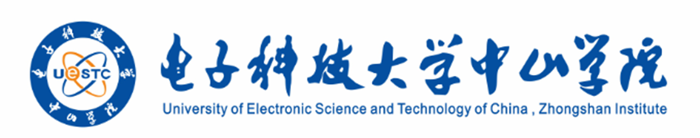

# 学生实践报告

 

实践名称：___软件工程综合实践（与课程名称一致）___

专业班级：________________________

姓　　名：___姓名1, 姓名2, 姓名3___

学　　号：___学号1, 学号2...___

学　　号：___学号3, 学号4...___

指导教师：________何怀文________

实践时间：___第14-17周 周六、日1-8节(和排课时间一致)___

实践单位：________计算机学院________

教学单位：________计算机学院________

实践地点：________厚德楼B607________

## 实践计划
|  |  |
| ---- | ---- |
| **实践目的** | 进一步掌握Java语言基础、Servlet和Spring、SpringBoot、MyBatis、MyBatis-plus等开源框架组件的使用。通过餐厅管理系统完整软件开发项目，让学生了解软件项目开发全流程，具备编写项目需求说明书、设计说明书、测试报告等文档的能力，培养独立思考、独立工作能力与团队协作精神。 |
| **实践内容** | 前期准备要求： （1）掌握Java语法基础。（2）掌握面向对象编程思想（封装、继承、多态）。（3）掌握Java常用类、集合框架。（4）掌握Mybatis数据库访问技术。（5）掌握SpringBoot应用开发技术。（6）掌握Java EE分层设计思想和开发技术。（7）掌握前后端分离的开发模式。 项目实训要求： （1）将上述知识运用到餐厅管理系统项目中，自主理解需求与业务逻辑，完成系统需求分析、概要设计、详细设计、编码、测试等工作。 （2）完成项目成果展示，提交需求说明书、项目进度计划书、设计说明书、源代码、测试计划、测试报告、用户手册、实训总结等资料。 |
| **实践安排** | 实训分组安排：23计科D班，每组3-6人。 实训日程安排： （1）项目准备：2个课时，包括项目理解、需求确定、人员分组分工、技术方案选择、编程规范制定、开发测试环境搭建等。 （2）项目设计：2个课时，包括概要设计、详细设计、数据库设计等。 （3）项目编码：6个课时，包括分层架构实现和单元测试等。 （4）项目验收：2个课时，包括测试项目、验收和交付等。 （5）项目总结：4个课时，包括实训总结、项目成果展示等。 |
| **实践指导** | 1. 王肖锋. Java Web高级编程. 清华大学出版社. 2. 黑马程序员. SpringBoot企业级开发教程. 人民邮电出版社 3. Spring Boot、MyBatis-Plus、Vue 3官方文档 |

## 实践记录

### 1 项目名称

餐厅管理系统

### 2 项目背景

传统中小型餐厅在点餐、后厨协同、收银结算和经营统计方面常依赖纸单或分散工具，容易出现订单信息不同步、催单遗漏、出餐状态不清晰、库存和销量脱节等问题。为提升餐厅日常运营效率，本项目设计并实现了一个面向游客、服务员、前台、后厨、经理和店长的餐厅管理系统，实现从点餐、制作、上桌、收款、清桌到经营分析的一体化管理。

### 3 开发技术

1. 后端：Java 17、Spring Boot 3.3.5、MyBatis-Plus 3.5.7。
2. 前端：Vue 3、Vite 5、JavaScript、CSS。
3. 数据库：MySQL 8。
4. 开发工具：IntelliJ IDEA、Maven、Node.js、npm。

## 4. 小组成员及分工

| 姓名         | 任务                                                                 | 工作量                             | 备注 |
| ------------ | -------------------------------------------------------------------- | ---------------------------------- | ---- |
| Xx（组长）   | 负责前端业务逻辑的处理                                               | 0.3（工作量高最后分得的分数会多） |      |
| Xx           | 负责构建后端服务类、控制器等，构建数据库和添加数据                 | 0.3                                |      |
| Xxx          |                                                                      |                                    |      |
|              |                                                                      |                                    |      |

### 5 系统概述

本系统采用前后端分离架构。后端负责用户、桌台、菜品、原料、订单、后厨队列、光盘记录和经营分析等业务接口；前端提供统一工作台，根据角色展示不同功能入口。系统支持游客自助点餐、服务员协助点餐、前台收款、后厨制作、经理提权、店长查看经营数据，形成较完整的餐厅业务闭环。

### 6 需求分析

1. 员工能够注册和登录，并根据角色进入不同工作区域。
2. 支持桌台、菜品分类、菜品、配料和原料库存的基础管理。
3. 支持游客与服务员下单，记录单品特殊要求、整单备注和顾客备注。
4. 支持后厨查看制作队列，并对订单项进行待制作、制作中、已出餐、已上桌状态流转。
5. 支持前台收款、经理提权、服务员催单和清桌记录。
6. 支持基于订单、销量和光盘记录的经营分析与库存预警。

### 7 系统设计

#### 7.1 系统主要流程图

[图片1：餐厅管理系统整体业务流程图，内容包括“顾客/服务员下单→后厨制作→服务员上桌→前台收款→清桌记录→经营分析”]

#### 7.2 系统用例图

[图片2：餐厅管理系统用例图，参与者包括游客、服务员、前台、后厨、经理、店长]

#### 7.3 功能模块图

[图片3：系统功能模块图，内容包括顾客点餐、经营总览、桌台管理、原料库存、菜单中心、订单工作台、后厨看板、经营分析]

#### 7.4 数据库设计（E-R 图）

[图片4：数据库 E-R 图，展示 user、dining_table、dish_category、dish、material_stock、dish_material、restaurant_order、order_item、plate_waste_record 等实体关系]

#### 7.5 主要数据表说明

1. 表 user：保存员工账号、昵称、角色等信息。
2. 表 dining_table：保存桌台名称、人数容量、区域和状态。
3. 表 dish_category、dish：保存菜品分类和菜品信息。
4. 表 material_category、material_stock：保存原料分类、库存、单位和预警状态。
5. 表 dish_material：保存菜品与原料之间的用量关系。
6. 表 restaurant_order、order_item：保存订单主表和订单项明细。
7. 表 plate_waste_record：保存清桌时的光盘情况记录。

## 实践记录

### 8 系统实现及测试

#### 8.1 工程目录结构图

[图片5：工程目录结构图，重点展示 src/main/java、src/main/resources、frontend、sql 等目录]

#### 8.2 主要的类及其介绍

1. RestaurantManagementApplication：Spring Boot 启动类，负责项目整体启动。
2. UserController、UserServiceImpl：负责员工注册、登录和用户信息处理。
3. RestaurantOrderController、RestaurantOrderServiceImpl：实现创建订单、收款、提权、催单、确认上桌、光盘记录等核心业务。
4. KitchenController：负责后厨队列查询以及订单项制作状态流转。
5. DiningTableController、DishController、MaterialController：分别负责桌台、菜品、原料库存等基础数据管理。
6. AuthSessionManager、RoleInterceptor、@RequireRoles：实现轻量级登录态与角色权限控制。
7. frontend/src/App.vue：前端主界面，负责顾客点餐、订单工作台、后厨看板和经营分析等交互。

#### 8.3 系统功能模块实现

##### （1）员工登录与角色控制模块的实现

模块介绍：员工输入用户名和密码后登录系统，不同角色看到不同导航入口和操作按钮。  
关键代码如下：UserController、UserServiceImpl、RoleInterceptor、App.vue 中的角色计算属性与页面切换逻辑。  
实现效果截图：  
[图片6：员工登录界面，以及服务员/前台/后厨/经理不同工作台页面截图]

##### （2）顾客点餐与订单创建模块的实现

模块介绍：游客可直接点餐，服务员和前台可代客下单；系统支持标准菜品、菜单外定制菜、单品特殊要求、整单备注和顾客备注。  
关键代码如下：CreateOrderRequest、CreateOrderItemRequest、RestaurantOrderServiceImpl.createOrder、前端订单表单和购物车逻辑。  
实现效果截图：  
[图片7：顾客点餐页或订单工作台“新建订单”区域截图，体现桌台选择、菜品选择、备注输入和订单提交]

##### （3）后厨制作、催单与提权模块的实现

模块介绍：后厨按照订单项维度处理制作任务，服务员可催单并确认上桌，经理可设置订单优先级和提权原因。  
关键代码如下：KitchenController、RestaurantOrderServiceImpl.startItem、readyItem、serveItem、urgeItem、prioritizeOrder。  
实现效果截图：  
[图片8：后厨看板截图，展示待制作/制作中/已出餐状态，以及催单或提权后的高亮信息]

##### （4）收款、清桌与光盘记录模块的实现

模块介绍：前台完成收款并可录入优惠金额；订单全部上桌后进入待清桌状态，服务员记录每道菜的光盘情况后释放桌台。  
关键代码如下：RestaurantOrderServiceImpl.payOrder、recordWaste，实体 PlateWasteRecord 及相关 Mapper。  
实现效果截图：  
[图片9：订单详情中的收款区、光盘记录区和清桌完成后的桌台状态变化截图]

##### （5）经营分析模块的实现

模块介绍：系统统计累计营收、已完成订单、热销菜品、高浪费菜品和低库存预警，为经营决策提供依据。  
关键代码如下：AnalyticsController、RestaurantOrderServiceImpl.getAnalyticsSummary。  
实现效果截图：  
[图片10：经营总览和经营分析页面截图，展示营收、订单数、销量排行和库存预警]

#### 8.4 系统测试

##### 1. 功能测试内容

1. 员工登录与不同角色页面跳转测试。
2. 桌台、原料、菜品的增删改查测试。
3. 顾客点餐、服务员代客下单和定制菜下单测试。
4. 库存校验、订单催单、提权、确认上桌、收款、清桌测试。
5. 经营分析、热销统计和低库存预警测试。

##### 2. 关键测试结果

1. 系统可以正确完成从下单到清桌的完整业务闭环。
2. 订单备注、顾客备注和单品特殊要求能够在订单详情中正确展示。
3. 定制菜能够进入后厨队列，已完成订单会正确释放桌台。
4. 经营分析结果能够根据订单和光盘记录自动更新。

##### 3. 测试结论

系统已完成课程实践要求的核心功能，能够支持餐厅日常运营的主要业务流程。

## 实践总结（每人独立写一页，根据项目完成情况）

本次软件工程综合实践围绕“餐厅管理系统”展开，我在项目开发过程中对完整的软件工程流程有了更加清晰的认识。项目并不是简单地把页面做出来，而是要先分析真实业务场景，再根据角色职责梳理系统功能，最后结合技术栈逐步落地实现。通过本次实践，我进一步理解了需求分析、数据库设计、接口设计、页面交互、前后端联调和系统测试之间的关系。

在团队协作方面，我们按照“需求与设计、前端实现、后端实现、测试与文档整理”的思路分工推进，同时通过沟通不断调整接口字段和页面交互细节。例如订单模块不仅要考虑点餐本身，还要考虑后厨制作、服务员上桌、前台收款、经理提权、清桌记录等后续流程，因此实际开发中需要不断对业务闭环进行补充和修正。

本项目中让我感受最深的技术难点主要有三个。第一是数据库模型设计，要让桌台、菜品、原料、订单、订单项和光盘记录之间形成清晰关联，同时兼顾定制菜等特殊场景。第二是订单生命周期的状态流转，需要保证待制作、制作中、已出餐、已上桌、已支付、待清桌、已完成等状态之间逻辑正确。第三是前后端联调，既要保证接口返回结构稳定，也要让前端根据不同角色正确控制页面入口和操作权限。

通过本次实践，我不仅提高了 Java Web 项目的开发能力，也更加理解了一个系统从“能运行”到“能支撑业务”的差别。后续如果继续完善该项目，我希望增加更细粒度的权限管理、订单消息提醒、图片上传留证、报表导出、更加规范的组件拆分和自动化测试能力，让系统在可维护性和完整性方面进一步提升。

（如需按成员分别提交，可在此基础上根据个人分工、个人收获和个人问题处理过程继续修改补充。）

## 成绩评定

| 评分项目                                                         | 成员1（替换小组成员） | 成员2 | 成员3 |
| ---------------------------------------------------------------- | ---------------------- | ----- | ----- |
| 考勤情况（10%）                                                  |                        |       |       |
| 工作态度（10%）                                                  |                        |       |       |
| 实训报告（10%）                                                  |                        |       |       |
| 应用数学知识、计算机原理与技术、软件工程理论与方法的能力（10%）  |                        |       |       |
| 开发实践所需技术、方法及使用现代工具的能力（10%）                |                        |       |       |
| 设计、开发、维护及管理计算机程序与软件系统的能力（10%）          |                        |       |       |
| 项目管理、有效沟通、领域整合与团队协作的能力（10%）              |                        |       |       |
| 研究及应用科技成果、解决综合性复杂性信息问题的能力（10%）        |                        |       |       |
| 了解技术前沿与产业趋势及其影响，培养持续学习的习惯与能力（10%）  |                        |       |       |
| 理解及遵守专业伦理、职业道德及职业规范，认知社会责任（10%）      |                        |       |       |
| **总分**                                                         |                        |       |       |

 

指导老师：____________________（签、章）　　日期：______年______月______日